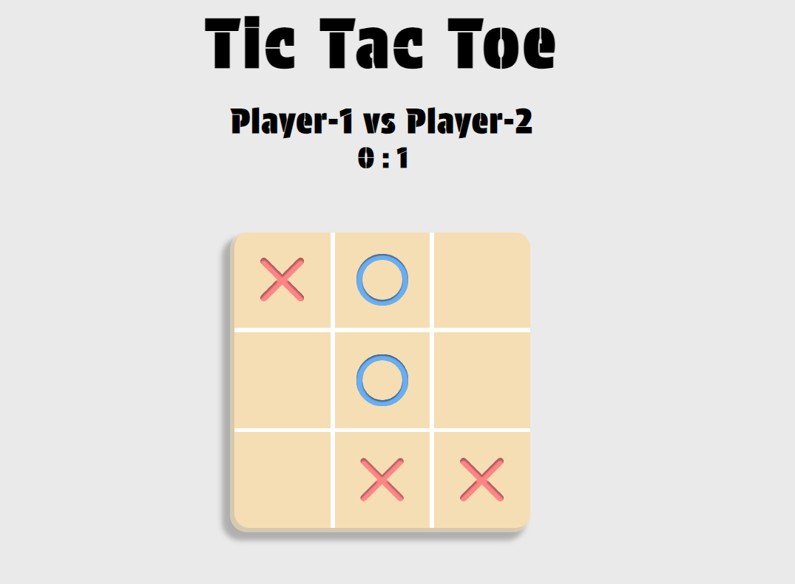

# Tic Tac Toe

A simple, interactive Tic Tac Toe game built using **HTML**, **CSS**, and **JavaScript**. The game allows two players to compete, keep track of their scores, and play multiple rounds.

## Table of Contents

- [Features](#features)
- [Installation and Usage](#installation-and-usage)
- [Live Demo](#live-demo)
- [Screenshot](#screenshot)
- [Files](#files)
- [How to Play](#how-to-play)
- [Contributing](#contributing)
- [Dependencies](#dependencies)

## Features

- **Player Input**: Players can enter their names for "X" and "O" before starting the game.
- **Dynamic Scoreboard**: Displays player names and their current scores.
- **Interactive Game Board**: A 3x3 grid where players take turns placing "X" and "O". The grid automatically checks for a win or a tie.
- **Winning/Tie Modal**: A modal is shown when a player wins or the game ends in a tie, allowing the players to reset the board.
- **Responsive Design**: The layout adjusts for different screen sizes, including mobile and small screens.
- **Hover Effects**: Interactive hover effects for buttons and grid cells.

## Installation and Usage

1. Clone the repository or download the project files.
2. Open the `index.html` file in a web browser to start the game.
3. Enter player names for "X" and "O" in the provided input fields.
4. Press the "Play" button to start the game.
5. Click on the cells to place "X" and "O" alternately.
6. A modal will appear to announce the winner or a tie, and you can click "Play Again" to reset the board.

## Live Demo

You can view the live version of the project here:
[**Tic Tac Toe Live Demo**](https://vedad24.github.io/TOP-TicTacToe/)

## Screenshot



## Files

- **index.html**: The main structure of the webpage.
- **style.css**: Contains the styling for the game layout, responsive design, and modal.
- **script.js**: The game logic that handles the player moves, win/tie conditions, and resets the game.

## How to Play

- Players take turns clicking on the cells of the 3x3 grid to place "X" or "O".
- The first player to align three of their marks horizontally, vertically, or diagonally wins.
- If all cells are filled without a winner, the game results in a tie.
- The game can be played repeatedly by clicking the "Play Again" button after each round.

## Contributing

Contributions are welcome! If you have any suggestions or improvements, feel free to:

1. Fork the repository.
2. Create a new branch (`git checkout -b feature/your-feature`).
3. Commit your changes (`git commit -m 'Add some feature'`).
4. Push to the branch (`git push origin feature/your-feature`).
5. Open a pull request.

## Dependencies

The project uses the following Google font:
```css
@import url('https://fonts.googleapis.com/css2?family=Protest+Guerrilla&display=swap');
